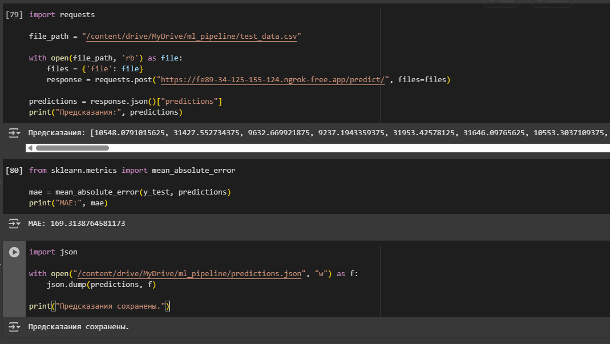

# ML Pipeline with FastAPI: Laptop Price Predictor

## Описание проекта

Этот проект представляет собой **ML-пайплайн** для предсказания цен на ноутбуки.  
Модель обучена на данных о характеристиках ноутбуков из файла `Laptop_price.csv` и развернута через **FastAPI**.

🔍 API принимает CSV-файл с ноутбуками и возвращает предсказания стоимости для каждой строки.

---

## Содержимое репозитория

| Файл | Описание |
|------|----------|
| `app.py` | Основной файл FastAPI-приложения |
| `laptop_price_model.pkl` | Сохранённая модель машинного обучения |
| `Laptop_price.csv` | Исходный датасет для обучения модели |
| `test_data.csv` | Пример тестового файла для проверки API |
| `predictions.json` | Сохранённые предсказания (для демонстрации) |
| `requirements.txt` | Список зависимостей проекта |
| `README.md` | Документация проекта |

---

## Установка и запуск

### 1. Установка зависимостей

## Установите библиотеки:

```bash
pip install -r requirements.txt

```

## Содержимое requirements.txt:

fastapi==0.95.0
uvicorn==0.23.2
joblib==1.2.0
pandas==1.5.3
scikit-learn==1.2.2
xgboost==1.7.6
requests==2.28.2

### 2. Запуск FastAPI-сервера

```bash
uvicorn app:app --host 0.0.0.0 --port 8000
```
После запуска API будет доступен по адресу:
http://localhost:8000

## Использование API

Эндпоинт /predict/
Метод: POST
Тип данных: multipart/form-data
Параметры запроса: CSV-файл под ключом file
Ответ: JSON с предсказаниями

## Пример запроса с использованием Python:

import requests
file_path = "test_data.csv"
with open(file_path, 'rb') as file:
    files = {'file': file}
    response = requests.post("http://localhost:8000/predict/", files=files)
predictions = response.json()["predictions"]
print("Предсказания:", predictions)

## Пример ответа от API:

{
  "predictions": [
    10548.08,
    31427.55,
    9632.67,
    9237.19,
    31953.43,
    31646.90,
    10553.30
  ]
}

### Результаты тестирования:

## На скриншоте показано:

- Загрузка CSV-файла через Swagger-интерфейс (/docs)
- Получение массива предсказаний
- Вычисление метрики MAE
- Сохранение результата в predictions.json



